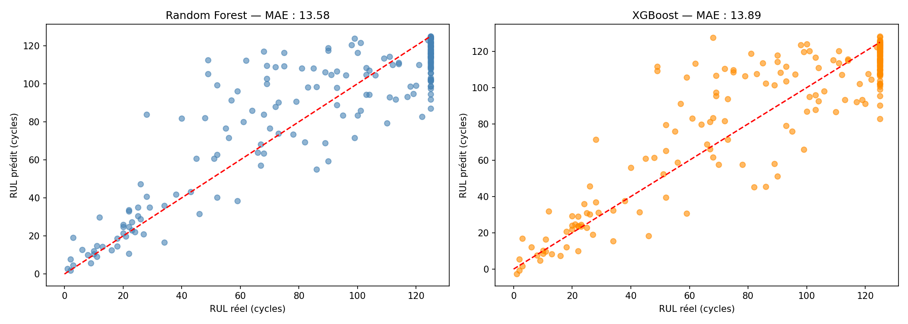

# Maintenance Prédictive — NASA CMAPSS

## Description
Modèle de Machine Learning pour prédire la durée de vie restante (RUL) 
de moteurs d'avion à partir de données capteurs industriels NASA.
Deux algorithmes ont été implémentés et comparés : Random Forest et XGBoost. 
Le Random Forest a obtenu les meilleures performances avec une MAE de 13.58 cycles.

## Résultats
- MAE : 13.58 cycles (Random Forest)
- RMSE : 18.79 cycles (Random Forest)
- Algorithmes : Random Forest et XGBoost comparés

**Légende :**
- **MAE (Mean Absolute Error)** : erreur moyenne de prédiction. 
  En moyenne, le modèle se trompe de 13.58 cycles sur sa prédiction de durée de vie restante.
- **RMSE (Root Mean Square Error)** : pénalise davantage les grosses erreurs. 
  Un RMSE de 18.79 cycles indique que même les pires prédictions restent raisonnables.
## Visualisations

### RUL par moteur

Chaque courbe représente un moteur. On observe que le RUL diminue 
progressivement au fil des cycles — c'est la dégradation naturelle 
du moteur. Le plafonnement à 125 cycles permet de focaliser le modèle 
sur la zone critique proche de la panne.

### Comparaison Random Forest vs XGBoost

Chaque point représente une prédiction du modèle. Plus les points 
sont proches de la ligne rouge, plus le modèle est précis. 
Le Random Forest (MAE : 13.58) surpasse légèrement XGBoost (MAE : 13.89) 
sur ce dataset — c'est lui qui est retenu comme modèle final.

### Prédictions vs Réalité — Random Forest

Un point en dessous de la ligne rouge signifie que le modèle 
sous-estime le RUL — il pense que la panne arrive plus tôt. 
Un point au dessus signifie qu'il surestime — plus dangereux 
en contexte industriel. Le modèle est particulièrement précis 
pour les faibles RUL, là où la précision est la plus critique.

## Dataset
NASA CMAPSS — C-MAPSS Aircraft Engine Simulator Data  
100 moteurs simulés, 21 capteurs, 3 paramètres opérationnels

## Technologies
- Python 3
- Pandas, NumPy
- Scikit-learn, XGBoost
- Matplotlib, Seaborn

## Compétences démontrées
- Traitement de données industrielles capteurs
- Feature engineering et préparation des données
- Modélisation prédictive par régression (Random Forest, XGBoost)
- Comparaison et évaluation de modèles ML
- Visualisation et interprétation des résultats 

## Perspectives
Prochainement je compte complété par une implémentation 
avec un réseau de neurones LSTM afin de comparer ses performances 
avec le Random Forest et le XGBoost sur ce même dataset.