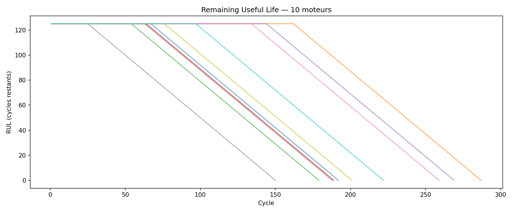
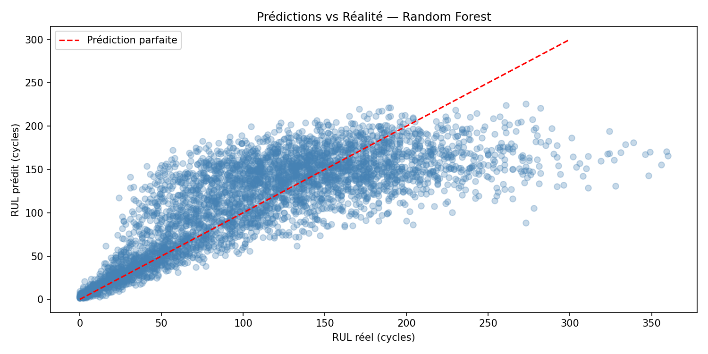

# Maintenance Prédictive — NASA CMAPSS

## Description
Modèle de Machine Learning pour prédire la durée de vie restante (RUL) 
de moteurs d'avion à partir de données capteurs industriels NASA.

## Résultats
- MAE : 29.56 cycles
- RMSE : 41.39 cycles
- Algorithme : Random Forest (100 estimateurs)

## Visualisations

## Dataset
NASA CMAPSS — C-MAPSS Aircraft Engine Simulator Data  
100 moteurs simulés, 21 capteurs, 3 paramètres opérationnels

## Technologies
- Python 3
- Pandas, NumPy
- Scikit-learn
- Matplotlib, Seaborn

## Compétences démontrées
- Traitement de données industrielles capteurs
- Feature engineering
- Modélisation prédictive (régression)
- Évaluation et visualisation de modèles ML